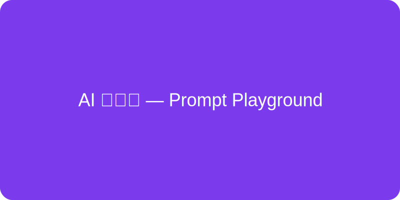

# AI 小精灵 — Prompt Playground（图文跑通指南）

这是 AI 小精灵（Prompt Playground）项目的图文版跑通 README，逐步带你从本地运行、Supabase 配置、到部署与关键交互验证。每一步都有截图占位（仓库内已有示例资源），你可以用真实截图替换这些占位图以形成自己的项目文档。

---

目录
- 快速预览
- 本地快速跑通（图文）
- 启用 Supabase（图文）
- 配置环境变量（图文）
- 部署到 Vercel（图文）
- 功能验收清单（图文）
- 常见问题与排查
- 安全注意事项

---

快速预览



上图为项目视觉示意（示例 SVG）。正式文档里建议用你自己部署后截取的首页截图替换此图。

---

一、本地快速跑通（图文，2 分钟体验版）

1) 克隆仓库并进入目录：

```bash
git clone https://github.com/jianyuhao02-ui/aiwebgame.git
cd aiwebgame
```

2) 安装依赖：

```bash
npm install
```

3) 启动开发服务器：

```bash
npm run dev
```

4) 打开浏览器访问：

http://localhost:3000

页面示例（本地运行后截图替换下图）：


说明：如果未配置 Supabase / OPENAI_API_KEY，页面会使用“示例模式（mock）”呈现交互，你仍能体验模板、吉祥物动画、导出等功能。

---

二、启用 Supabase（持久化“保存宠物”）

目标：让用户能够登录并把自己的宠物/微应用保存到云端数据库，以便后续载入与分享。

1) 在 Supabase 创建项目（控制台截图示例）：


2) 在 Supabase 控制台 → SQL Editor 运行初始化 SQL（仓库 `db/init.sql`）：

```sql
-- Init SQL for AIWebGame
CREATE EXTENSION IF NOT EXISTS pgcrypto;

CREATE TABLE public.pets (
  id uuid PRIMARY KEY DEFAULT gen_random_uuid(),
  name text NOT NULL,
  prompt text,
  my_items jsonb,
  mascot text,
  created_at timestamptz DEFAULT now()
);
```

执行成功后你会在 Table Editor 中看到 pets 表：

(在此处放置 Table Editor 的截图)

3) 获取 Supabase Keys（在 Settings → API）：
- Project URL（复制到 NEXT_PUBLIC_SUPABASE_URL）
- anon/public key（复制到 NEXT_PUBLIC_SUPABASE_ANON_KEY）
- service_role key（复制到 SUPABASE_SERVICE_KEY，**务必仅后端使用**）

(在此处放置 API Keys 页面截图 —— 注意遮盖 key 内容)

---

三、配置环境变量（本地 & 部署）

本地开发：在项目根创建 `.env.local` 并添加：

```
NEXT_PUBLIC_SUPABASE_URL=your-supabase-url
NEXT_PUBLIC_SUPABASE_ANON_KEY=your-anon-key
SUPABASE_SERVICE_KEY=your-service-role-key
OPENAI_API_KEY=your-openai-key    # 可选
```

> 注意：不要提交 `.env.local` 到仓库；仓库已包含 `.env.example` 供参考。

部署（以 Vercel 为例）：在 Vercel 项目 Settings → Environment Variables 中新增上述变量，并确保 `SUPABASE_SERVICE_KEY` 标记为 server-only（仅后端可见）。

示例：Vercel Env 添加截图（占位）

(此处放置 Vercel 环境变量设置截图)

---

四、部署到 Vercel（图文步骤）

1) 登录 Vercel，选择 New Project → Import Git Repository → 选择 `jianyuhao02-ui/aiwebgame`。
2) 添加 Environment Variables（与本地 `.env.local` 一致）。
3) 点击 Deploy，等待构建完成。
4) 打开分配域名验证功能（登录、保存、导出）。

(此处放置 Vercel 部署成功页面截图)

---

五、功能验收清单（图文）

1) UI 验收（无需 Supabase）
- 打开页面：模板卡、我的应用面板、吉祥物动画存在
- 单击模板卡会把示例 prompt 填入编辑区
- 点击“生成”在未配置 OpenAI Key 时显示示例输出

截图示例（替换为真实截图）：


2) Supabase & Auth（需配置）
- 登录（magic link）能收到邮件并登录
- 登录后点击“保存宠物”会把条目插入数据库并出现在“已保存的宠物”列表
- 点击“载入”可以加载已保存配置

(此处放置已保存列表截图)

3) 导出验证
- 点击“导出微应用”会下载 `my-ai-microapp.html`
- 在本地打开导出 HTML，默认为示例模式；若填入 OPENAI API Key 可以调用真实模型（仅用于本地测试，切勿公开包含 key 的文件）

---

六、常见问题与排查（图文示例）

1) 未收到登录邮件
- 检查垃圾箱；确认 Supabase 项目是否开启邮件发送服务
- 如需临时绕过，可把后端 API 用 SUPABASE_SERVICE_KEY 手动插入一条测试数据（参考 `pages/api/save.ts`）

2) /api/save 返回 501/500
- 501：说明后端未配置 SUPABASE_SERVICE_KEY（检查 .env.local 或部署平台环境变量）
- 500：检查数据库表是否创建（是否运行了 db/init.sql）

3) Lottie 动画不显示
- 在浏览器直接访问: `http://localhost:3000/animations/idle.json` 测试静态资源是否可访问

4) 音效无法播放
- 浏览器需要用户交互解锁音频，尝试先点击页面上的任意按钮再测试音效

---

七、安全提醒

- 绝对不要把 SUPABASE_SERVICE_KEY 或 OPENAI_API_KEY 提交到公共仓库或在公共场合分享。
- 导出文件不会包含任何 Key；如果你选择在导出页面填入 Key，仅为本地测试目的，请勿把导出文件上传到不受信任的地方。

---

八、如何替换占位截图

仓库内示例图片位于 `public/assets/`。建议流程：
1. 在浏览器中打开本地运行的页面（或 Vercel 部署地址），截图关键步骤（登录、模板、我的应用、导出）。
2. 把截图放入 `public/docs/`（按步骤命名，如 `01-home.png`, `02-login.png`）。
3. 编辑本 README（相应位置替换图片路径），提交并 push。

---

如果你要，我可以：
- 帮你生成 `public/docs` 的占位 PNG（用矢量示例或自动截图）并把 README 中的占位图替换为这些真实占位图；或
- 我可以在 README 中加入实际操作的终端/控制台截图模板并生成一份 PDF 指南供分享。

回复“帮我生成 docs 占位图”或“把 README 转成 PDF”我就继续处理并把变更推到仓库。祝你运行顺利！
